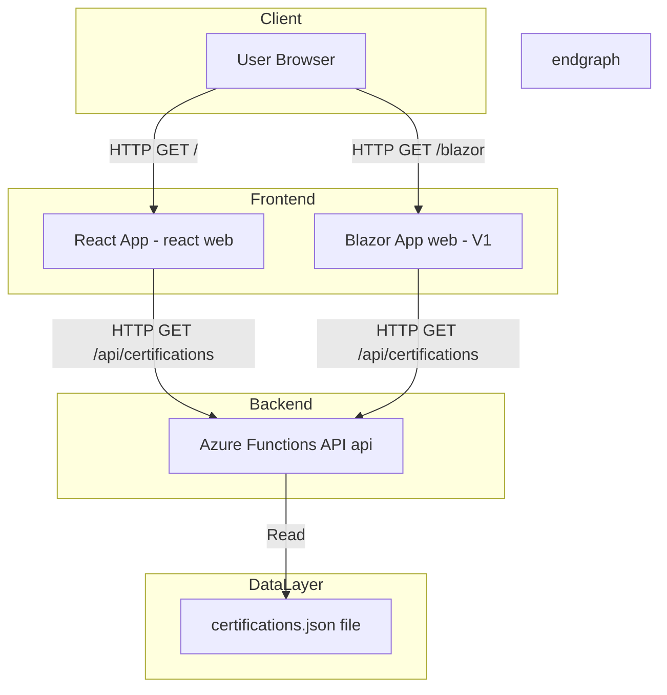

```mermaid

graph TD

subgraph Client
  Browser[User Browser]
end

subgraph Frontend
  ReactApp[React App - react web]
  BlazorApp[Blazor App web - V1]
end

subgraph Backend
  AzureFunc[Azure Functions API api]
end

subgraph DataLayer
  JSONFile[certifications.json file]
  %% Future DB[Azure DB - Blob / Cosmos / SQL]
end

Browser -->|HTTP GET /| ReactApp
Browser -->|HTTP GET /blazor| BlazorApp

ReactApp -->|HTTP GET /api/certifications| AzureFunc
BlazorApp -->|HTTP GET /api/certifications| AzureFunc

AzureFunc -->|Read| JSONFile
%% AzureFunc -->|Future Query| DB


endgraph
```
